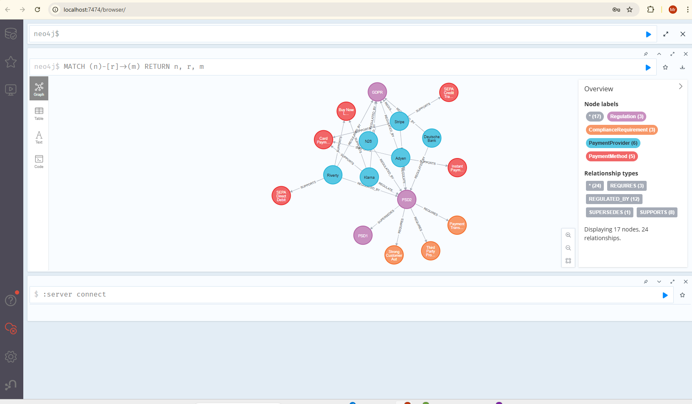

# FinTech Knowledge Assistant

A production-aware **GraphRAG** system that answers EU payment and financial regulation questions by combining a **Neo4j knowledge graph** with **vector-based document retrieval**.

Built with **Spring Boot + Spring AI + Neo4j + PGVector**. Supports both **local Ollama models** and **Anthropic Claude API** for chat.

<p align="center">
  
</p>

## What It Does

### Phase 1: Document RAG
Upload EU regulation PDFs, and the system will:
- Chunk documents into ~300-token pieces with metadata
- Embed each chunk into 768-dimensional vectors using a local AI model
- Store embeddings in PostgreSQL with PGVector extension
- Answer questions by finding the most relevant chunks and feeding them to an LLM
- Filter answers by regulation name (e.g., only search PSD2 documents)

### Phase 2: Knowledge Graph + GraphRAG
A Neo4j knowledge graph models the FinTech regulatory landscape:
- **Payment Providers** (Riverty, Klarna, Adyen, Stripe, Deutsche Bank, N26) with their types, countries, and licenses
- **Regulations** (PSD2, PSD1, SCA-RTS, GDPR, AMLD5) with directive numbers and effective dates
- **Compliance Requirements** (SCA, TPP Access, Payment Transparency) linked to regulations
- **Payment Methods** (SEPA Credit Transfer, SEPA Direct Debit, Card Payment, BNPL, Instant Payment)
- **Relationships**: REGULATED_BY, REQUIRES, SUPPORTS, SUPERSEDES

The **GraphRAG endpoint** fuses both sources — it extracts entities from a question, queries the knowledge graph for structured context, retrieves relevant document chunks from PGVector, then sends both to the LLM for a comprehensive answer.

## Architecture

```
+------------------------------------------------------------------+
|                    Spring Boot Application                        |
|                                                                    |
|  +----------------+  +------------------+  +-------------------+  |
|  | Ingestion      |  | RAG Query        |  | Graph Query       |  |
|  | Controller     |  | Controller       |  | Controller        |  |
|  | POST /ingest   |  | GET /rag/ask     |  | GET /graph/...    |  |
|  +-------+--------+  +--------+---------+  +--------+----------+  |
|          |                     |                     |             |
|          v                     v                     v             |
|  +----------------+  +------------------+  +-------------------+  |
|  | Document       |  | RAG Retrieval    |  | Knowledge Graph   |  |
|  | Ingestion      |  | Service          |  | Service           |  |
|  | Service        |  +--------+---------+  +--------+----------+  |
|  +-------+--------+           |                     |             |
|          |                     |                     |             |
|          |            +--------+---------+           |             |
|          |            | GraphRAG Service |<----------+             |
|          |            | GET /graph-rag   |                         |
|          |            | (Fusion Layer)   |                         |
|          |            +--------+---------+                         |
+----------|---------------------|---------------------------------+
           |                     |
           v                     v
  +------------------+  +------------------+  +------------------+
  |  PostgreSQL +    |  |  Neo4j 5         |  |  Ollama (Local)  |
  |  PGVector        |  |  Knowledge Graph |  |  - nomic-embed   |
  |  (Vector Store)  |  |  Port 7474/7687  |  |  Port 11434      |
  |  Port 5433       |  +------------------+  +------------------+
  +------------------+                        +------------------+
                                              |  Anthropic API   |
                                              |  - Claude Haiku  |
                                              |  (Cloud Chat)    |
                                              +------------------+
```

## Tech Stack

| Component | Technology | Purpose |
|-----------|-----------|---------|
| Framework | Spring Boot 3.5.x | REST API, DI, configuration |
| AI Framework | Spring AI 1.1.2 | Embedding, vector store, chat client, RAG advisor |
| Chat Model | Claude Haiku (Anthropic API) or llama3.2:3b (Ollama) | Answer generation from context |
| Embedding Model | nomic-embed-text (via Ollama) | Text to 768-dim vector conversion |
| Vector Store | PostgreSQL + PGVector | Vector similarity search + metadata filtering |
| Knowledge Graph | Neo4j 5 Community Edition | Structured entity/relationship storage |
| Graph ORM | Spring Data Neo4j | Entity mapping and repository queries |
| Index Type | HNSW | Fast approximate nearest neighbor search |

## Regulations Ingested

| Regulation | Chunks | Description |
|-----------|--------|-------------|
| PSD2 Directive (2015/2366) | 379 | Payment Services Directive 2 |
| PSD2 RTS on SCA (2018/389) | 86 | Strong Customer Authentication requirements |
| PSD2 Quick Guide | 11 | Latham & Watkins overview |
| SEPA Regulation (260/2012) | 83 | Single Euro Payments Area |
| MiCA (2023/1114) | 751 | Markets in Crypto-Assets |
| DORA (2022/2554) | 371 | Digital Operational Resilience Act |
| EMD2 (2009/110/EC) | 57 | E-Money Directive |
| AMLD5 (2018/843) | 144 | 5th Anti-Money Laundering Directive |
| AMLD6 (2018/1673) | 42 | 6th Anti-Money Laundering Directive |
| GDPR (2016/679) | 404 | General Data Protection Regulation |
| IFR (2015/751) | 76 | Interchange Fee Regulation |
| **Total** | **2,404** | **11 EU regulations** |

### Download Links (EUR-Lex)

All regulations are freely available from the official EU law portal. Download the PDFs and place them in `docs/regulations/`:

| Regulation | Download |
|-----------|----------|
| PSD2 Directive | [EUR-Lex 2015/2366](https://eur-lex.europa.eu/legal-content/EN/TXT/PDF/?uri=CELEX:32015L2366) |
| PSD2 RTS on SCA | [EUR-Lex 2018/389](https://eur-lex.europa.eu/legal-content/EN/TXT/PDF/?uri=CELEX:32018R0389) |
| SEPA Regulation | [EUR-Lex 260/2012](https://eur-lex.europa.eu/legal-content/EN/TXT/PDF/?uri=CELEX:32012R0260) |
| MiCA | [EUR-Lex 2023/1114](https://eur-lex.europa.eu/legal-content/EN/TXT/PDF/?uri=CELEX:32023R1114) |
| DORA | [EUR-Lex 2022/2554](https://eur-lex.europa.eu/legal-content/EN/TXT/PDF/?uri=CELEX:32022R2554) |
| EMD2 | [EUR-Lex 2009/110/EC](https://eur-lex.europa.eu/legal-content/EN/TXT/PDF/?uri=CELEX:32009L0110) |
| AMLD5 | [EUR-Lex 2018/843](https://eur-lex.europa.eu/legal-content/EN/TXT/PDF/?uri=CELEX:32018L0843) |
| AMLD6 | [EUR-Lex 2018/1673](https://eur-lex.europa.eu/legal-content/EN/TXT/PDF/?uri=CELEX:32018L1673) |
| GDPR | [EUR-Lex 2016/679](https://eur-lex.europa.eu/legal-content/EN/TXT/PDF/?uri=CELEX:32016R0679) |
| IFR | [EUR-Lex 2015/751](https://eur-lex.europa.eu/legal-content/EN/TXT/PDF/?uri=CELEX:32015R0751) |

> The PSD2 Quick Guide is a third-party overview by Latham & Watkins, not an official EU document.

## Prerequisites

| Tool | Version | Check |
|------|---------|-------|
| Java JDK | 17 or 21 | `java -version` |
| Maven | 3.9+ | `mvn -version` |
| Docker + Compose | Latest | `docker --version` |

## Quick Start

### 1. Start Infrastructure

```bash
docker compose up -d
docker exec fka-ollama ollama pull llama3.2:3b
docker exec fka-ollama ollama pull nomic-embed-text
```

This starts three services:
- **PostgreSQL + PGVector** on port 5433 (vector store)
- **Ollama** on port 11434 (embedding model + optional chat)
- **Neo4j** on ports 7474 (browser) / 7687 (bolt) — knowledge graph

### 2. Configure the Chat Model

The application supports two chat model backends. Ollama embeddings are always used for vector search regardless of which chat model you choose.

#### Option A: Anthropic Claude API (Recommended — faster)

Create a `.env` file in the project root (this file is gitignored):

```bash
ANTHROPIC_API_KEY=your-api-key-here
```

Then run:

```bash
export $(cat .env | xargs) && ./mvnw spring-boot:run
```

#### Option B: Local Ollama (free, no API key needed)

To switch back to the local Ollama model, make these changes:

1. In `FintechKnowledgeAssistantApplication.java`, remove the `OllamaChatAutoConfiguration` exclusion:
   ```java
   @SpringBootApplication  // remove the (exclude = {...}) part
   ```

2. In `application.yaml`, replace the Anthropic + Ollama config with:
   ```yaml
   spring.ai:
     ollama:
       base-url: http://localhost:11434
       chat:
         options:
           model: llama3.2:3b
           temperature: 0.3
       embedding:
         options:
           model: nomic-embed-text
   ```

3. Remove or comment out the `spring.ai.anthropic` section.

> **Note:** The local Ollama model runs on CPU and is significantly slower (~1-3 min per query on most machines). The Anthropic API returns answers in 2-5 seconds.
>
> For detailed step-by-step switching instructions, see [SWITCHING-CHAT-MODELS.md](SWITCHING-CHAT-MODELS.md).

### 3. Run the Application

```bash
# With Anthropic (load .env first)
export $(cat .env | xargs) && ./mvnw spring-boot:run

# With Ollama (no .env needed)
./mvnw spring-boot:run
```

On startup, the application automatically seeds the Neo4j knowledge graph with providers, regulations, compliance requirements, and payment methods (only on first run — skips if data already exists).

### 4. Ingest a PDF

```bash
curl -X POST http://localhost:8080/api/ingest/pdf \
  -F "file=@docs/regulations/your-document.pdf" \
  -F "regulation=REGULATION_NAME"
```

### 5. Ask Questions

```bash
# Phase 1: Document RAG — search all documents
curl "http://localhost:8080/api/rag/ask?question=What%20is%20PSD2?"

# Phase 1: Document RAG — search specific regulation only
curl "http://localhost:8080/api/rag/ask/filtered?question=What%20is%20SCA?&regulation=PSD2"

# Phase 2: GraphRAG — combines knowledge graph + document context
curl "http://localhost:8080/api/graph-rag/ask?question=What%20regulations%20does%20Riverty%20comply%20with?"
```

### 6. Browse the Knowledge Graph

```bash
# List all payment providers with their regulations and payment methods
curl "http://localhost:8080/api/graph/providers"

# Get a specific provider
curl "http://localhost:8080/api/graph/providers/Riverty"

# Get compliance requirements for a provider
curl "http://localhost:8080/api/graph/providers/Riverty/compliance"

# Get all providers regulated by a specific regulation
curl "http://localhost:8080/api/graph/regulations/PSD2/providers"

# Get the regulation supersedes chain (e.g., PSD2 -> PSD1)
curl "http://localhost:8080/api/graph/regulations/PSD2/chain"
```

You can also browse Neo4j visually at [http://localhost:7474](http://localhost:7474) (login: neo4j / fka_password).

## API Endpoints

### Document Ingestion
| Method | Endpoint | Description |
|--------|----------|-------------|
| POST | `/api/ingest/pdf` | Upload and ingest a PDF (multipart: file + regulation name) |

### Phase 1: Document RAG
| Method | Endpoint | Description |
|--------|----------|-------------|
| GET | `/api/rag/ask?question=X` | Ask a question across all documents |
| GET | `/api/rag/ask/filtered?question=X&regulation=Y` | Ask within a specific regulation |

### Phase 2: Knowledge Graph
| Method | Endpoint | Description |
|--------|----------|-------------|
| GET | `/api/graph/providers` | List all payment providers with regulations and payment methods |
| GET | `/api/graph/providers/{name}` | Get a specific provider by name |
| GET | `/api/graph/providers/{name}/compliance` | Get compliance requirements for a provider |
| GET | `/api/graph/regulations/{name}/providers` | Get all providers regulated by a regulation |
| GET | `/api/graph/regulations/{name}/chain` | Get the regulation supersedes chain |

### Phase 2: GraphRAG (Fusion)
| Method | Endpoint | Description |
|--------|----------|-------------|
| GET | `/api/graph-rag/ask?question=X` | Ask using both knowledge graph + document context |

## Knowledge Graph Schema

```
(:PaymentProvider)-[:REGULATED_BY]->(:Regulation)-[:REQUIRES]->(:ComplianceRequirement)
(:PaymentProvider)-[:SUPPORTS]->(:PaymentMethod)
(:Regulation)-[:SUPERSEDES]->(:Regulation)
```

### Entities

| Node | Properties | Count |
|------|-----------|-------|
| PaymentProvider | name, type (PSP/ASPSP), country, licenseType | 6 |
| Regulation | name, fullName, directiveNumber, effectiveDate, jurisdiction | 5 |
| ComplianceRequirement | name, article, description, category | 3 |
| PaymentMethod | name, type (PUSH/PULL/DEFERRED) | 5 |

### How GraphRAG Works

1. **Entity Extraction** — LLM extracts entity names from the user's question
2. **Graph Query** — Matched entities are looked up in Neo4j for structured context (provider details, regulations, requirements, payment methods, regulation chains)
3. **Vector Search** — The question is embedded and the top-5 most similar document chunks are retrieved from PGVector
4. **Context Fusion** — Both structured (graph) and unstructured (documents) contexts are combined into a single prompt
5. **LLM Answer** — The LLM synthesizes a comprehensive answer using both sources

This gives significantly richer answers than document RAG alone — the graph provides factual relationships while documents provide legal detail and exact wording.

## Project Structure

```
fintech-knowledge-assistant/
├── docker-compose.yml                          # Ollama + PostgreSQL + Neo4j
├── docs/regulations/                           # EU regulation PDFs
├── pom.xml
├── src/main/java/com/fka/
│   ├── FintechKnowledgeAssistantApplication.java
│   ├── config/                                 # Spring AI beans
│   ├── ingestion/
│   │   ├── DocumentIngestionService.java       # PDF -> chunks -> vectors
│   │   └── IngestionController.java            # POST /api/ingest
│   ├── retrieval/
│   │   ├── RagRetrievalService.java            # Question -> answer (RAG)
│   │   └── RagQueryController.java             # GET /api/rag
│   └── graph/
│       ├── config/
│       │   └── Neo4jConfig.java                # Neo4j transaction manager
│       ├── model/
│       │   ├── PaymentProvider.java            # @Node entity
│       │   ├── Regulation.java                 # @Node entity
│       │   ├── ComplianceRequirement.java      # @Node entity
│       │   └── PaymentMethod.java              # @Node entity
│       ├── repository/
│       │   ├── PaymentProviderRepository.java  # Neo4j CRUD + custom queries
│       │   └── RegulationRepository.java       # Neo4j CRUD + custom queries
│       ├── service/
│       │   ├── GraphDataLoader.java            # Seeds Neo4j on first startup
│       │   ├── KnowledgeGraphService.java      # Graph traversal + formatting
│       │   └── GraphRAGService.java            # Fusion: graph + vector + LLM
│       └── controller/
│           ├── GraphQueryController.java       # GET /api/graph/*
│           └── GraphRAGController.java         # GET /api/graph-rag/ask
├── src/main/resources/
│   ├── application.yaml                        # All configuration
│   └── prompts/
│       └── system-prompt.st                    # LLM system prompt
└── backups/                                    # Database backups
```

## Key Design Decisions

| Decision | Choice | Why |
|----------|--------|-----|
| Chat LLM | Claude Haiku (API) / llama3.2:3b (local) | API is fast (~3s); local is free but slow on CPU |
| Embedding | nomic-embed-text (local Ollama) | 768-dim, high quality, always runs locally |
| Vector Store | PGVector | Familiar SQL, metadata filtering, Spring AI integration |
| Knowledge Graph | Neo4j 5 Community | Industry-standard graph DB, Cypher query language, Spring Data support |
| Graph Seeding | MERGE statements in ApplicationRunner | Idempotent — safe to restart without duplicating data |
| JPA + Neo4j Coexistence | Explicit @EnableJpaRepositories + @EnableNeo4jRepositories with separate base packages | Prevents Spring Data module conflicts in strict mode |
| Neo4j Transaction Manager | Explicit bean with transactionManagerRef | Required when JPA and Neo4j share the same Spring context |
| GraphRAG Fusion | Entity extraction -> graph query -> vector search -> combined prompt | Structured facts from graph + legal detail from documents |
| Chunk Size | 300 tokens | Balance precision vs context for dense regulatory text |
| Top-K (RAG) | 10 | Enough context for comprehensive regulatory answers |
| Top-K (GraphRAG) | 5 | Graph context already provides structured facts, fewer chunks needed |
| Temperature | 0.3 | Factual and deterministic for regulatory Q&A |
| Similarity Threshold | 0.0-0.2 | Permissive — lets the LLM judge relevance from more candidates |

## License

This project is for educational and portfolio purposes.
